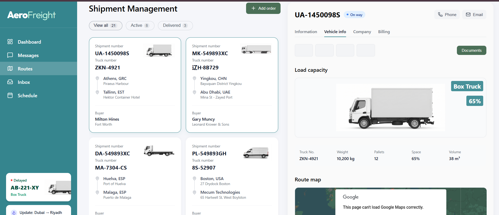
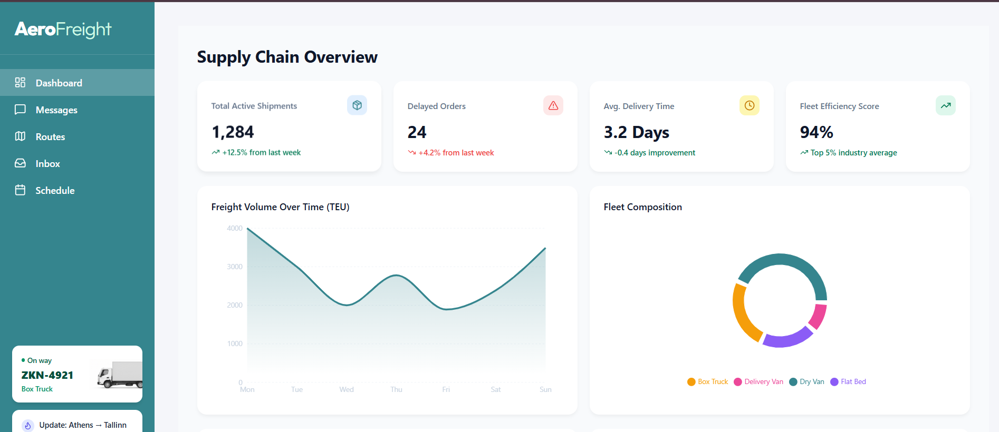

SupplyChainAI
=============

**SupplyChainAI** is a full-stack application designed to optimize and manage supply chain logistics through AI-powered insights and real-time tracking. The project integrates Google's Generative AI for intelligent chat assistance and Google Maps for visualizing delivery routes.

  

  
  

🚀 Key Features
---------------

*   **AI Chat Assistant**: Integrated with Google Gemini (GenAI) to provide supply chain support and logistics insights.
    
*   **Order Management**: View and track status for multiple orders.
    
*   **Real-time Route Mapping**: Visualization of delivery paths using the Google Maps API.
    
*   **Inventory Dashboard**: Overview of stock levels and warehouse status.
    
*   **Responsive UI**: Modern, component-based frontend built with React.

    https://github.com/user-attachments/assets/34cb457d-b5be-4877-8052-575b37e3454a

🛠️ Tech Stack
--------------

### Backend

### Frontend

*   **Library**: React.js
    
*   **Maps API**: Google Maps JavaScript API (@react-google-maps/api)
    
*   **Styling**: Modern CSS/React Components
    

⚙️ Installation & Setup
-----------------------

### Prerequisites

*   Node.js and npm installed.
    
*   A Google Cloud Project for AI and Maps API keys.
    

### 1\. Backend Setup

3.  Code snippetPORT=5000GOOGLE\_GENAI\_API\_KEY=your\_gemini\_api\_key
    

### 2\. Frontend Setup

1.  Navigate to the directory: cd frontend
    
2.  Install dependencies: npm install
    
3.  Configure your Google Maps API Key in src/components/RoutesPage.jsx within the tag.
    
4.  Start the app: npm run dev
    

🐳 Docker Support
-----------------

You can run the backend in a containerized environment:

📁 Project Structure
--------------------

*   /frontend: React components, state management, and mapping interface.
